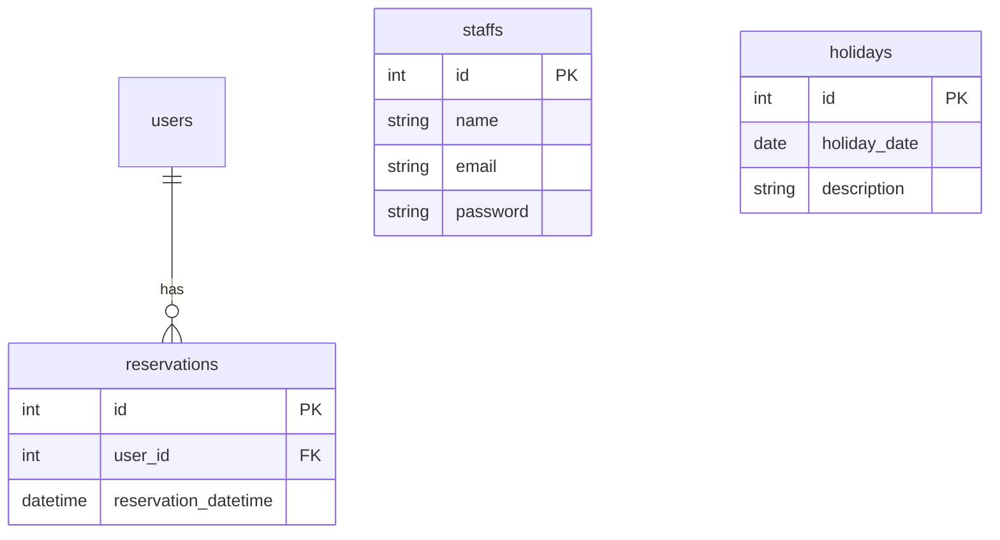

# 動物病院ホームページ - 技術仕様書

このドキュメントは「要件定義書」に基づき、開発で用いる具体的な技術や実装の仕様、簡単なコード例を定義します。

## 1. 使用技術

- **バックエンド:** PHP 8.x / Laravel 10.x
- **フロントエンド:** Blade (Laravel標準テンプレートエンジン), CSS, JavaScript
- **データベース:** MySQL or PostgreSQL
- **開発環境:** ローカル開発環境 (PHP 8.x, Composer, Node.js)

## 2. 主要機能の仕様とコード例

### 2.1. マルチ認証

顧客 (User) と従業員 (Staff) で認証を分離します。

#### 2.1.1. `config/auth.php` の設定

`guards` と `providers` を設定し、`staff` 認証ガードを追加します。

```php
// config/auth.php

'guards' => [
    'web' => [
        'driver' => 'session',
        'provider' => 'users',
    ],
    // 従業員用のガードを追加
    'staff' => [
        'driver' => 'session',
        'provider' => 'staffs',
    ],
],

'providers' => [
    'users' => [
        'driver' => 'eloquent',
        'model' => App\Models\User::class,
    ],
    // 従業員用のプロバイダーを追加
    'staffs' => [
        'driver' => 'eloquent',
        'model' => App\Models\Staff::class,
    ],
],
```

#### 2.1.2. `Staff` モデルとマイグレーション

従業員情報を格納する `Staff` モデルと対応するマイグレーションを作成します。

```bash
php artisan make:model Staff -m
```

```php
// database/migrations/xxxx_xx_xx_xxxxxx_create_staffs_table.php

public function up(): void
{
    Schema::create('staffs', function (Blueprint $table) {
        $table->id();
        $table->string('name');
        $table->string('email')->unique();
        $table->timestamp('email_verified_at')->nullable();
        $table->string('password');
        $table->rememberToken();
        $table->timestamps();
    });
}
```

#### 2.1.3. ルーティング (`routes/web.php`)

従業員用のログイン画面や管理画面へのルートを `/admin` プレフィックスで定義し、`auth:staff` ミドルウェアで保護します。

```php
// routes/web.php

use App\Http\Controllers\Admin\AuthenticatedSessionController;

// 顧客向け（Laravel標準）
Route::get('/dashboard', function () {
    return view('dashboard');
})->middleware(['auth'])->name('dashboard');

require __DIR__.'/auth.php';


// --- 従業員向け ---
Route::prefix('admin')->name('admin.')->group(function () {
    // ログイン画面
    Route::get('/login', [AuthenticatedSessionController::class, 'create'])->name('login');
    // ログイン処理
    Route::post('/login', [AuthenticatedSessionController::class, 'store']);
    // ログアウト
    Route::post('/logout', [AuthenticatedSessionController::class, 'destroy'])->name('logout');

    // 管理画面（要認証）
    Route::get('/dashboard', function() {
        return view('admin.dashboard');
    })->middleware('auth:staff')->name('dashboard');
});
```

### 2.2. 予約機能

#### 2.2.1. `Reservation` モデルとマイグレーション

```bash
php artisan make:model Reservation -m
```

```php
// database/migrations/xxxx_xx_xx_xxxxxx_create_reservations_table.php

public function up(): void
{
    Schema::create('reservations', function (Blueprint $table) {
        $table->id();
        $table->foreignId('user_id')->constrained()->onDelete('cascade');
        $table->dateTime('reservation_datetime');
        $table->timestamps();

        // 同じ時間帯に複数の予約が入らないようにユニーク制約を設定
        $table->unique(['reservation_datetime']);
    });
}
```

#### 2.2.2. 予約コントローラーのバリデーション例

予約処理時には、定休日、臨時休診日、予約の重複をチェックするカスタムバリデーションルールを作成します。

```php
// app/Http/Controllers/ReservationController.php

use Illuminate\Http\Request;
use App\Rules\NotOnHoliday; // カスタムルール
use App\Rules\NotOnRegularHoliday; // カスタムルール

public function store(Request $request)
{
    $request->validate([
        'reservation_datetime' => [
            'required',
            'date',
            'after:now',
            new NotOnRegularHoliday(), // 定休日チェック
            new NotOnHoliday(),      // 臨時休診日チェック
            'unique:reservations,reservation_datetime' // 予約重複チェック
        ],
    ]);

    // バリデーション通過後の予約作成処理...
}
```

### 2.3. 休診日管理

#### 2.3.1. `Holiday` モデルとマイグレーション

```bash
php artisan make:model Holiday -m
```

```php
// database/migrations/xxxx_xx_xx_xxxxxx_create_holidays_table.php

public function up(): void
{
    Schema::create('holidays', function (Blueprint $table) {
        $table->id();
        $table->date('holiday_date')->unique();
        $table->string('description')->nullable(); // 休診理由
        $table->timestamps();
    });
}
```

#### 2.3.2. カスタムバリデーションルールの実装例

`NotOnHoliday` ルールで、指定された日付が `holidays` テーブルに存在しないかチェックします。

```php
// app/Rules/NotOnHoliday.php

namespace App\Rules;

use Illuminate\Contracts\Validation\Rule;
use App\Models\Holiday;
use Carbon\Carbon;

class NotOnHoliday implements Rule
{
    public function passes($attribute, $value)
    {
        // $value は 'reservation_datetime'
        $date = Carbon::parse($value)->format('Y-m-d');
        return !Holiday::where('holiday_date', $date)->exists();
    }

    public function message()
    {
        return '指定された日は臨時休診日です。';
    }
}
```

### 2.4. カレンダー表示機能

休診日や予約可能な日時をカレンダー形式で表示するため、FullCalendar.js を利用する。

#### 2.4.1. APIエンドポイントの作成

休診日情報をフロントエンドに提供するためのAPIエンドポイントを作成する。

```php
// routes/api.php

use App\Http\Controllers\Api\HolidayController;

Route::get('/holidays', [HolidayController::class, 'index']);
```

#### 2.4.2. HolidayController (API) の実装例

`Holiday` モデルから休診日データを取得し、JSON形式で返す。

```php
// app/Http/Controllers/Api/HolidayController.php

namespace App\Http\Controllers\Api;

use App\Http\Controllers\Controller;
use App\Models\Holiday;
use Illuminate\Http\Request;

class HolidayController extends Controller
{
    public function index()
    {
        $holidays = Holiday::all()->map(function ($holiday) {
            return [
                'date' => $holiday->holiday_date,
                'description' => $holiday->description,
            ];
        });

        return response()->json($holidays);
    }
}
```

#### 2.4.3. フロントエンド (JavaScript) での FullCalendar.js の利用例

FullCalendar.js を初期化し、APIエンドポイントから休診日データを取得してカレンダーに表示する。

```javascript
// resources/js/app.js (または適切なJavaScriptファイル)

import { Calendar } from '@fullcalendar/core';
import dayGridPlugin from '@fullcalendar/daygrid';

document.addEventListener('DOMContentLoaded', function() {
    var calendarEl = document.getElementById('calendar');
    var calendar = new Calendar(calendarEl, {
        plugins: [ dayGridPlugin ],
        initialView: 'dayGridMonth',
        events: '/api/holidays', // APIエンドポイントからイベントデータを取得
        eventDidMount: function(info) {
            // イベント（休診日）の表示をカスタマイズ
            if (info.event.extendedProps.description) {
                info.el.title = info.event.extendedProps.description; // ツールチップ表示
            }
            info.el.style.backgroundColor = 'red'; // 休診日を赤色で表示
            info.el.innerHTML = '×'; // 日付に「×」を表示
        }
        // その他のFullCalendar設定...
    });
    calendar.render();
});
```

## 3. データベース設計

要件定義書に基づき、以下のテーブルを作成します。

- **users:** 顧客情報 (Laravel標準)
- **password_reset_tokens:** パスワードリセット用 (Laravel標準)
- **failed_jobs:** FAILED JOB用 (Laravel標準)
- **personal_access_tokens:** API TOKEN用 (Laravel標準)
- **staffs:** 従業員情報
- **reservations:** 予約情報
- **holidays:** 臨時休診日情報


