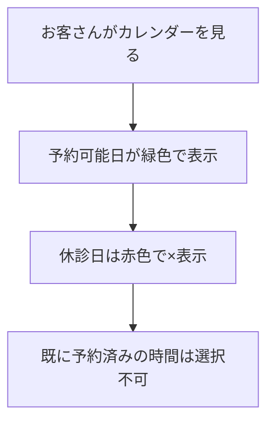

# 🏥 動物病院ホームページ - 初学者向け仕様書

こんにちは！新しいチームメンバーのみなさん、お疲れ様です 😊  
この仕様書では、私たちが作る動物病院のホームページについて、分かりやすく説明していきます！

## 🎯 何を作るの？

**Laravel** を使って、動物病院のホームページを作ります！  
主な機能は以下の通りです：

### 🐾 お客さん（飼い主さん）ができること
- 👤 **会員登録・ログイン**
- 📅 **ペットの診察予約**（カレンダーから選択）
- 👀 **自分の予約確認・キャンセル**
- 📋 **病院の休診日カレンダー閲覧**

### 👩‍⚕️ 病院スタッフができること  
- 🔐 **スタッフ専用画面にログイン**
- 📝 **全予約の確認・管理**
- 🏥 **臨時休診日の登録**（学会参加など）

### 📄 みんなが見れるページ
- 🏠 **トップページ**（病院の魅力を紹介）
- 🏥 **病院紹介ページ**（院長先生の挨拶など）
- 💬 **お客様の声ページ**（利用者の感想）

## 🛠️ 使う技術スタック

| 分野 | 技術 | 用途 |
|------|------|------|
| **Backend** | PHP 8.x + Laravel 10.x | サーバーサイド処理 |
| **Frontend** | Blade + Tailwind CSS | 画面デザイン |
| **Database** | MySQL | データ保存 |
| **Calendar** | FullCalendar.js | カレンダー表示 |

## 📊 データベース設計

私たちが扱うデータは4つのテーブルに分かれています：

### 👥 users（お客さん情報）
```
id, name, email, password, created_at, updated_at
```

### 👩‍⚕️ staffs（スタッフ情報）
```
id, name, email, password, created_at, updated_at
```

### 📅 reservations（予約情報）
```
id, user_id, reservation_datetime, created_at, updated_at
```

### 🏥 holidays（休診日情報）
```
id, holiday_date, description, created_at, updated_at
```

### 🔗 テーブル間の関係
- 1人のお客さん（user）は複数の予約（reservations）を持てる
- 予約は必ず1人のお客さんに紐づく

## 🔐 ログイン機能の仕組み

### 🌟 マルチ認証って何？
お客さんとスタッフで **別々のログイン画面** を用意します！

| 利用者 | ログインURL | 行き先 |
|--------|-------------|---------|
| 👤 お客さん | `/login` | 一般向けダッシュボード |
| 👩‍⚕️ スタッフ | `/admin/login` | 管理画面 |

### 🛡️ なぜ分ける？
- **セキュリティ**: 管理画面への不正アクセスを防止
- **UX**: それぞれに最適な画面を提供
- **権限管理**: 機能ごとにアクセス制御

## 📅 予約システムの流れ

### 1️⃣ カレンダー表示


### 2️⃣ 予約の制約チェック
予約する前に、以下をチェックします：

- ❌ **定休日**（毎週日曜日など）
- ❌ **臨時休診日**（学会参加など）
- ❌ **予約重複**（同じ時間に別の予約）
- ❌ **過去の日付**（今日より前の日は選択不可）

### 3️⃣ 予約完了
✅ 全てのチェックをクリアしたら予約確定！

## 🏗️ 開発体制（2週間プロジェクト）

### 👨‍💻 チーム構成
| チーム | 人数 | 主な担当 |
|--------|------|----------|
| **リーダー** | 1名 | 🖥️ バックエンド全般 |
| **静的ページ** | 3名 | 🎨 HTML/CSS デザイン |
| **Blade化** | 4名 | 🔧 Laravel テンプレート化 |

### 📅 スケジュール
#### 1週目：基盤作り
- **リーダー**: DB設計、認証機能
- **静的ページ**: デザイン作成
- **Blade化**: Laravel学習、テンプレート作成

#### 2週目：機能統合
- **リーダー**: 予約機能、API作成
- **静的ページ**: 残りページ作成
- **Blade化**: 全ページ統合
- **全員**: 最終テスト

## 🌳 Git運用ルール

### 📋 ブランチ戦略
```
main         ← 🚀 本番環境（絶対に直接編集禁止！）
  ↑
develop      ← 🔄 開発の中心（直接編集禁止！）
  ↑
feature/*    ← ✏️ 実際の作業場所
```

### 🔄 作業の流れ
1. **開始前**: `develop`を最新にする
   ```bash
   git checkout develop
   git pull origin develop
   ```

2. **作業用ブランチ作成**
   ```bash
   git checkout -b feature/your-task-name
   ```

3. **作業 & コミット**
   ```bash
   git add .
   git commit -m "feat: トップページのヒーロー画像を追加"
   ```

4. **完了後**: Pull Request作成 → レビュー → マージ

### 🚫 コンフリクト回避術

#### 💣 危険地帯（コンフリクトしやすい場所）
- `routes/web.php` - みんながルートを追加する
- `database/migrations/` - DB変更ファイル
- `resources/views/layouts/` - 共通レイアウト

#### 🛡️ 予防策
- **担当分け**: 作業範囲を明確に分ける
- **こまめなpull**: 作業前に必ず最新情報を取得
- **相談**: 共通部分を触る前にチームに確認

## 🖼️ 画像ファイル管理

### 📁 ディレクトリ構造
```
public/images/
├── common/          # 🌟 共通画像（ロゴなど）
├── pages/
│   ├── home/        # 🏠 トップページ用
│   ├── about/       # 🏥 病院紹介用
│   ├── voices/      # 💬 お客様の声用
│   └── admin/       # 👩‍⚕️ 管理画面用
└── temp/            # 🗂️ 開発中の一時画像
```

### 📝 命名規則
```
{ページ名}_{用途}_{連番}.{拡張子}

例:
- home_hero_01.jpg      (トップページのメイン画像)
- about_staff_01.png    (スタッフ写真)
- common_logo.png       (サイトロゴ)
```

## 🎨 デザインガイドライン

### 🌈 カラーパレット
主要色は動物病院らしく、**優しく安心感のある色** を使用：
- **メインカラー**: 暖かみのある緑系
- **アクセントカラー**: 優しいブルー系
- **警告色**: 優しいオレンジ系

### 📱 レスポンシブ対応
- **PC**: 1200px以上
- **タブレット**: 768px〜1199px
- **スマホ**: 767px以下

## 🔧 開発環境セットアップ

### 📋 必要なもの
- PHP 8.x
- Composer
- Node.js
- MySQL
- Git

### 🚀 初回セットアップ（予定）
```bash
# 1. リポジトリをクローン
git clone [repository-url]

# 2. 依存関係をインストール
composer install
npm install

# 3. 環境設定
cp .env.example .env
php artisan key:generate

# 4. データベースセットアップ
php artisan migrate
php artisan db:seed

# 5. 開発サーバー起動
php artisan serve
```

## 📚 学習リソース

### 🔰 Laravel初心者向け
- **Laravel公式ドキュメント**: https://laravel.com/docs
- **Laravel入門チュートリアル**: おすすめサイトをSlackで共有予定

### 🎨 フロントエンド
- **Tailwind CSS**: https://tailwindcss.com/
- **Blade テンプレート**: Laravel公式ドキュメント内

### 🌳 Git学習
- **Git入門**: https://git-scm.com/book/ja/v2

## 📞 困ったときは？

### 🆘 質問・相談チャンネル
- **Slack/Discord**: 一般的な質問・相談
- **GitHub Issues**: バグ報告・機能要望
- **直接相談**: 緊急時やコンフリクト解消

### 🎯 質問のコツ
1. **エラーメッセージ**: 全文をコピペして共有
2. **コード**: どの部分で詰まっているか具体的に
3. **試したこと**: 既に試した解決策があれば教えて

## 🎉 最後に

このプロジェクトは、みんなで力を合わせて素晴らしい動物病院ホームページを作る絶好のチャンスです！  

- 🤝 **コミュニケーション**: 分からないことはすぐに聞く
- 🔄 **継続的な学習**: 新しい技術をどんどん吸収
- 🎯 **チームワーク**: お互いをサポートし合う

一緒に頑張りましょう！ 🚀✨

---

*この仕様書は開発の進行に合わせて随時アップデートされます 📝*